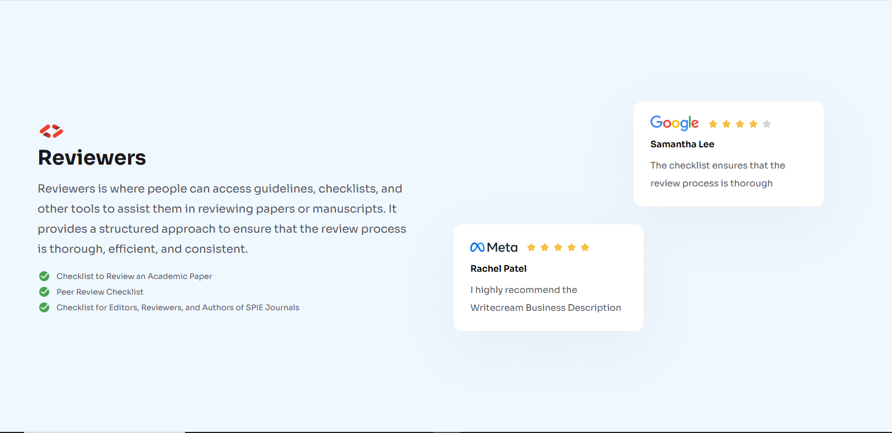

# DevChallenges – Testimonial Page

This is a solution for the [Testimonial Page challenge](https://devchallenges.io/) built using HTML and CSS.

## 📸 Preview

## 🛠️ Built With

- Semantic HTML5 markup
- CSS custom properties (variables)
- Flexbox layout

## 📁 Project Structure

- `index.html`
- `style.css`
- `img.png` (screenshot preview)

## 📌 Notes

- Fully responsive layout
- Tested on multiple screen sizes using Chrome DevTools
